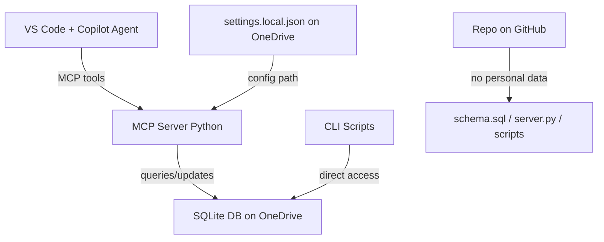

This is a well-scoped project with a clean separation of concerns. Here's my recommended plan.

---

## Architecture Overview



**Core idea:** A Python-based [MCP server](https://modelcontextprotocol.io) exposes tools to Copilot agent mode. Scripts handle data-heavy or repeatable tasks. The SQLite database and your personal config live on OneDrive, outside the repo.

---

## VS Code Extensions to Install

| Extension | Publisher | Purpose |
|---|---|---|
| **GitHub Copilot** | GitHub | The AI agent |
| **GitHub Copilot Chat** | GitHub | Agent/chat interface |
| **Python** | Microsoft | Python language support |
| **SQLite Viewer** | qwtel | Inspect your DB visually |
| **GitLens** | GitKraken | Optional, useful for repo history |

Install all five from the Extensions panel (`Ctrl+Shift+X`).

---

## GitHub Setup Steps

1. Install [Git for Windows](https://git-scm.com/download/win)
2. In a terminal, configure your identity:
   ```powershell
   git config --global user.name "Your Name"
   git config --global user.email "you@example.com"
   ```
3. Create a new **private** repo on GitHub (no README, no .gitignore — you'll push those)
4. After the project folder is created locally:
   ```powershell
   cd retirement-assistant
   git init
   git add .
   git commit -m "Initial commit"
   git remote add origin https://github.com/yourname/retirement-assistant.git
   git push -u origin main
   ```

---

## Project Structure

```
retirement-assistant/
├── .vscode/
│   └── mcp.json              # Registers the MCP server with Copilot
├── db/
│   └── schema.sql            # Source of truth for DB structure
├── mcp/
│   └── server.py             # MCP server exposing tools to Copilot
├── scripts/
│   ├── setup_db.py           # Creates/migrates the SQLite DB
│   ├── add_appointment.py    # CLI: add an appointment
│   ├── add_event.py          # CLI: add a timed event
│   └── add_activity.py       # CLI: add an activity suggestion
├── settings.example.json     # Template — safe to commit
├── .gitignore
├── requirements.txt
└── README.md
```

**What lives in OneDrive (never in the repo):**
- `retirement.db` — your SQLite database
- `settings.local.json` — points to the DB path, holds any personal prefs

---

## SQLite Schema (3 tables + 1 log)

```sql
CREATE TABLE appointments (
    id          INTEGER PRIMARY KEY AUTOINCREMENT,
    title       TEXT NOT NULL,
    location    TEXT,
    appt_dt     TEXT NOT NULL,   -- ISO 8601: "2026-06-17T09:00"
    notes       TEXT,
    created_at  TEXT DEFAULT (datetime('now'))
);

CREATE TABLE timed_events (
    id          INTEGER PRIMARY KEY AUTOINCREMENT,
    title       TEXT NOT NULL,
    description TEXT,
    url         TEXT,
    start_date  TEXT NOT NULL,   -- "2026-06-23"
    end_date    TEXT NOT NULL,   -- "2026-06-28"
    status      TEXT DEFAULT 'active',  -- active | done | dismissed
    created_at  TEXT DEFAULT (datetime('now'))
);

CREATE TABLE activities (
    id                  INTEGER PRIMARY KEY AUTOINCREMENT,
    title               TEXT NOT NULL,
    description         TEXT,
    location            TEXT,
    category            TEXT,             -- coffee, outdoor, cultural, etc.
    weather_sensitive   INTEGER DEFAULT 0, -- 1 = skip on rain/storm
    physical_intensity  INTEGER DEFAULT 1  -- 1=easy 2=moderate 3=strenuous
);

CREATE TABLE activity_log (
    id          INTEGER PRIMARY KEY AUTOINCREMENT,
    activity_id INTEGER REFERENCES activities(id),
    log_date    TEXT NOT NULL,           -- "2026-06-09"
    status      TEXT,                    -- suggested | done | skipped
    notes       TEXT
);
```

---

## MCP Server Tools (what Copilot can call)

| Tool | Does what | Script alternative? |
|---|---|---|
| `get_daily_briefing(date)` | Returns appointments ±1 day, active timed events, 2–3 activity picks | Yes — daily_briefing.py |
| `complete_timed_event(id)` | Marks a timed event done/dismissed | Yes |
| `log_activity(id, status, date)` | Records what you did | Yes |
| `list_activities()` | Returns the full activity pool | Yes |
| `add_appointment(...)` | Adds a new appointment | Yes — add_appointment.py |

The MCP tools are thin wrappers. The SQL logic lives in shared modules so both the MCP server and the standalone scripts use the same code.

---

## Daily Briefing Logic (script-first, token-efficient)

A `daily_briefing.py` script runs the queries and returns structured JSON. Copilot only interprets and narrates the result — it never scans raw data.

```
Script output → Copilot formats into natural language
```

**Appointment logic:** Surface appointments where `date(appt_dt)` is today or tomorrow.

**Timed event logic:** Surface rows where `start_date <= today <= end_date AND status = 'active'`.

**Activity suggestion logic:**
1. Exclude any activity logged as `done` yesterday
2. Order by `random()` with a weight boost for activities not suggested in the last 7 days
3. Return 3 candidates; you pick one
4. Future hook: accept `weather=rainy` param → exclude `weather_sensitive=1` activities

---

## Implementation Phases

| Phase | Scope |
|---|---|
| **1** | Project scaffold, `schema.sql`, `setup_db.py`, `settings.example.json`, `.gitignore` |
| **2** | MCP server with `get_daily_briefing` and `log_activity` tools; register in `.vscode/mcp.json` |
| **3** | CLI scripts for adding data; seed your first appointments and activities |
| **4** | Timed event completion flow; briefing narration refinement |
| **5** | Weather API integration (Open-Meteo is free, no key needed) |
| **6** | Physical readiness — could be a simple self-report the evening before |

---

## `settings.example.json` (safe to commit)

```json
{
  "db_path": "C:/Users/YOU/OneDrive/retirement-assistant/retirement.db",
  "briefing_lookback_days": 7,
  "activity_suggestions_per_day": 3
}
```

The real file (`settings.local.json`) goes in your OneDrive and is listed in `.gitignore`.

---

## Ready to Build?

Say the word and I'll scaffold Phase 1: the project folder, schema, setup script, settings template, `.gitignore`, and the MCP server stub — ready to register with Copilot agent mode. You'll just need to point `settings.local.json` at your OneDrive path and run `setup_db.py` to initialize the database.