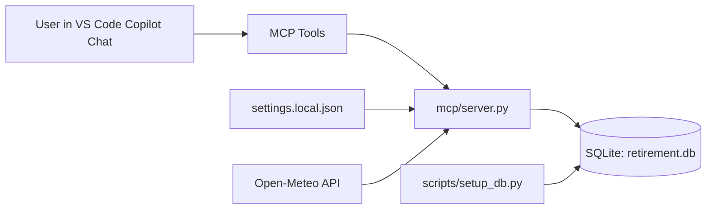

# Retirement Assistant Design

## Purpose

Retirement Assistant is a local-first planning system that helps manage daily life after retirement. It combines structured data (appointments, events, activity pool, and completion history) with MCP tools that let an AI assistant provide practical daily briefings and activity suggestions.

## Related Documents

- [ToDo](todo.md)

Design priorities:
- Keep personal data local in SQLite.
- Support natural-language operation through MCP tools.
- Keep behavior deterministic and inspectable through simple SQL-backed logic.
- Make activity suggestions context-aware (recent history, readiness, rain chance, and temperature).
- Support recurring life milestones with annual reminder logic.
- Prefer MCP tools as the default user-facing workflow, with scripts reserved for setup/maintenance.

## Conceptual Model (Source Of Truth)

This section defines the domain model Copilot and contributors should use when designing or changing behavior.

System objective:
- Help the user plan each day with low-friction capture and high-signal activity suggestions.
- Keep behavior explicit, testable, and local-first.

Core concepts:
- Daily briefing: a date-scoped snapshot that combines appointments, active timed events, annual reminders, and activity suggestions.
- Activity: a reusable candidate for activity suggestions, with metadata that affects filtering (`category`, `weather_sensitive`, `physical_intensity`, `repeatability_factor`, optional weekday availability, and optional links).
- Readiness: a user-provided energy/capacity signal (commonly 0-100) that gates which intensity levels are eligible.
- Weather sensitivity: whether an activity should be filtered out when rain chance is high and, in some rules, during high heat.
- Category: a user-facing label used for organization and diversity limits (one suggestion per category in the current selection stage).

Default behavioral rules (current implementation):
- Readiness bands:
    - `< 30`: only intensity 1
    - `< 70`: intensity 1-2
    - `>= 70`: intensity 2-3
- Rain filter:
    - If `rain_chance > 30`, weather-sensitive activities are excluded.
- Heat and temperature filters (when weather data is available):
    - If daily high `< 55F`: exclude category `motorcycle`
    - If daily high `> 75F`: exclude intensity 3
    - If daily high `> 85F`: exclude intensity 2 when weather-sensitive

User meaning (plain language):
- Lower readiness days prefer easier activities.
- Higher readiness days allow more demanding activities.
- Weather-sensitive activities are considered fair-weather options.

Category validation direction:
- Categories should use a strict allowed list that is user-configurable.
- Inputs should be normalized to lower-case before validation when case is the only mismatch.
- Unknown categories should be hard-rejected with a gentle, actionable message that:
    - names the invalid category,
    - lists configured allowed categories, and
    - explains how to add categories in `settings.local.json` before retrying.
- This strict validation behavior is a design target and should be implemented with MCP + test updates.

Configuration intent for tunable behavior:
- Defaults should remain documented in this section.
- User-specific overrides should be done in `settings.local.json`.
- Any new threshold/category configuration keys should be added to `settings.example.json` and documented here.

## Current System Shape

Core runtime path:
1. User asks for an action in natural language.
2. Copilot invokes an MCP tool.
3. `mcp/server.py` executes SQL against SQLite and returns structured JSON.
4. For daily briefings, server may enrich results with weather from Open-Meteo.

Schema compatibility note:
- `mcp/server.py` applies lightweight runtime migrations for backward compatibility (for example, adding `appointments.appt_end_dt` when missing).
- `scripts/setup_db.py` also applies the same compatibility migration path for direct setup/maintenance workflows.

## Repository Components

- `mcp/server.py`: MCP tool implementations and activity suggestion logic.
- `db/schema.sql`: source-of-truth schema for local database initialization.
- `scripts/setup_db.py`: initializes DB schema and applies compatibility migrations.
- `settings.example.json`: shared template settings.
- `settings.local.json`: local overrides (git-ignored) for personal paths/weather location.

## Data Model

Current tables:
- `appointments`: start datetime (`appt_dt`), optional end datetime (`appt_end_dt`), and optional notes.
- `timed_events`: date-range items with status lifecycle.
- `annual_events`: recurring annual reminders using an anchor date and advance notice window.
- `activities`: activity suggestion candidates with category, weather sensitivity, and physical intensity.
- `activity_urls`: one-to-many links for activities.
- `activity_log`: history of suggested/completed/skipped outcomes.

Modeling notes:
- `weather_sensitive` is `0/1` and used for rain and heat constraints.
- `physical_intensity` uses a 1-3 scale.
- `repeatability_factor` scales post-completion cooldown per activity (default `2`).
- `day_of_week_mask` stores weekday availability for activities; MCP tools accept user-facing weekday names via `available_days`.
- `activity_log` is the primary source for activity suggestion suppression.

## MCP Tool Surface

The MCP server currently exposes these capabilities:
- `get_daily_briefing`
- `log_activity`
- `add_appointment`
- `list_appointments`
- `update_appointment`
- `delete_appointment`
- `add_timed_event`
- `list_timed_events`
- `update_timed_event`
- `delete_timed_event`
- `add_annual_event`
- `list_annual_events`
- `update_annual_event`
- `delete_annual_event`
- `add_activity`
- `update_activity`
- `delete_activity`
- `get_activity_details`

These are optimized for conversational use while still returning explicit JSON for reliable behavior.

## Activity Suggestion Design

`get_daily_briefing` composes:
- Appointments for target date and next day.
- Active timed events spanning target date.
- Annual reminders for recurring events (day-of and exact lead-time reminders).
- Randomized activity suggestions after rule-based filtering.

Activity suggestion filtering rules currently implemented:
- Exclude activities logged as `done` within an activity-specific cooldown: `briefing_lookback_days * repeatability_factor`.
- Exclude activities that are not available on the target date weekday when `available_days` was provided.
- Apply readiness, rain, and temperature filters as defined in the Conceptual Model above.

Activity suggestion selection rules currently implemented:
- Candidate activities are randomized after filtering.
- Final suggestions are capped to one activity per category to improve variety.

Weather integration details:
- Source: Open-Meteo forecast endpoint.
- Configured in `settings.local.json` with `weather.enabled`, coordinates, and timezone.
- Daily briefing response includes a `weather` object with rain chance and min/max temperatures in C and F.

### Daily Briefing Pipeline (Architectural Overview)

All daily briefing logic is implemented in `mcp/server.py` inside the `get_daily_briefing` MCP tool.
The client layer (Copilot) invokes the tool and formats the structured response.

Pipeline steps:
1. Resolve target date from tool input (`date`) or default to today.
2. Open DB connection and apply compatibility migrations.
3. Load configuration (`briefing_lookback_days`, `activity_suggestions_per_day`, and weather settings).
4. Fetch appointments for target date and next day.
5. Fetch active timed events spanning target date.
6. Compute annual reminders (day-of anniversaries and exact lead-time reminders).
7. Fetch weather (when enabled): rain chance plus min/max temperatures.
8. Compute effective rain chance (explicit tool input wins; otherwise weather-derived value).
9. Build activity suggestion clauses (readiness, rain, temperature, and weekday availability).
10. Query candidate activities with cooldown suppression based on done logs and per-activity repeatability.
11. Randomize candidate order and apply one-per-category diversity cap.
12. Hydrate selected activities with URLs and available-days expansion.
13. Return structured JSON containing date, weather/rain inputs, appointments, active timed events, annual reminders, and activity suggestions.

Selection size note:
- Suggestion count is configuration-driven via `activity_suggestions_per_day` (default `3`), not hardcoded.

#### User Selection Model

The assistant does not require explicit user pre-selection of an anchor activity.
The user logs activities they actually performed later in the day.
Logged `status` and `log_date` values then drive cooldown/repeatability behavior in future briefings.

## Configuration Strategy

Shared config:
- `settings.example.json` contains safe defaults/template keys, including SeaTac weather coordinates (`47.4502`, `-122.3088`) as a concrete example.

Local config:
- `settings.local.json` overrides local paths and weather coordinates.
- It is intentionally git-ignored to avoid leaking personal filesystem paths or preferences.

Relevant settings keys:
- `db_path`
- `briefing_lookback_days`
- `activity_suggestions_per_day`
- `weather.enabled`
- `weather.latitude`
- `weather.longitude`
- `weather.timezone`

## Operational Notes

- The MCP process must be restarted to pick up code or settings changes.
- SSL trust for weather lookup is handled via `certifi` for reliable HTTPS verification.
- Database remains portable and user-controlled, making backup and migration straightforward.

## Known Constraints

- Activity suggestion selection is randomized after filtering, so outputs vary per run.
- Filtering depends on quality of activity metadata (category, intensity, weather sensitivity).
- Weather dependency is external; briefing still functions when weather lookup is unavailable.

## Near-Term Evolution Options

- Add deterministic ranking/priority score on top of random selection.
- Add category rotation to reduce repeated themes across days.
- Track and display why each suggested activity was selected.
- Add optional geofenced weather profile presets for travel periods.
- Add Google Calendar integration for two-way sync of appointments and timed events.