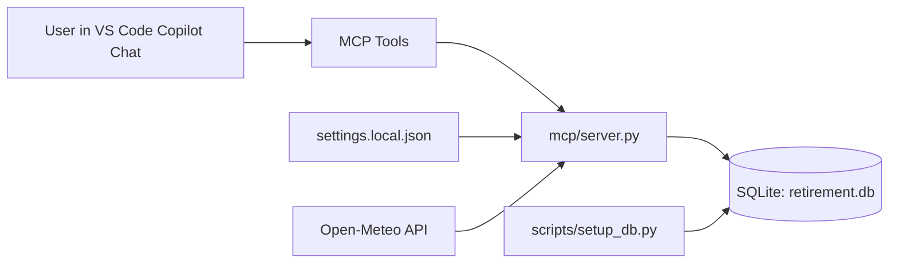

# Retirement Assistant Design

## Purpose

Retirement Assistant is a local-first planning system that helps manage daily life after retirement. It combines structured data (appointments, events, activity pool, and completion history) with MCP tools that let an AI assistant provide practical daily recommendations.

## Related Documents

- [ToDo](todo.md)

Design priorities:
- Keep personal data local in SQLite.
- Support natural-language operation through MCP tools.
- Keep behavior deterministic and inspectable through simple SQL-backed logic.
- Make recommendations context-aware (recent history, readiness, rain chance, and temperature).
- Support recurring life milestones with annual reminder logic.
- Prefer MCP tools as the default user-facing workflow, with scripts reserved for setup/maintenance.

## Current System Shape

Core runtime path:
1. User asks for an action in natural language.
2. Copilot invokes an MCP tool.
3. `mcp/server.py` executes SQL against SQLite and returns structured JSON.
4. For daily briefings, server may enrich results with weather from Open-Meteo.

Schema compatibility note:
- `mcp/server.py` applies lightweight runtime migrations for backward compatibility (for example, adding `appointments.appt_end_dt` when missing).
- `scripts/setup_db.py` also applies the same compatibility migration path for direct setup/maintenance workflows.

## Repository Components

- `mcp/server.py`: MCP tool implementations and recommendation logic.
- `db/schema.sql`: source-of-truth schema for local database initialization.
- `scripts/setup_db.py`: initializes DB schema and applies compatibility migrations.
- `settings.example.json`: shared template settings.
- `settings.local.json`: local overrides (git-ignored) for personal paths/weather location.

## Data Model

Current tables:
- `appointments`: start datetime (`appt_dt`), optional end datetime (`appt_end_dt`), and optional notes.
- `timed_events`: date-range items with status lifecycle.
- `annual_events`: recurring annual reminders using an anchor date and advance notice window.
- `activities`: recommendation candidates with category, weather sensitivity, and physical intensity.
- `activity_urls`: one-to-many links for activities.
- `activity_log`: history of suggested/completed/skipped outcomes.

Modeling notes:
- `weather_sensitive` is `0/1` and used for rain and heat constraints.
- `physical_intensity` uses a 1-3 scale.
- `repeatability_factor` scales post-completion cooldown per activity (default `2`).
- `day_of_week_mask` stores weekday availability for activities; MCP tools accept user-facing weekday names via `available_days`.
- `activity_log` is the primary source for recommendation suppression.

## MCP Tool Surface

The MCP server currently exposes these capabilities:
- `get_daily_briefing`
- `log_activity`
- `add_appointment`
- `list_appointments`
- `update_appointment`
- `delete_appointment`
- `add_timed_event`
- `list_timed_events`
- `update_timed_event`
- `delete_timed_event`
- `add_annual_event`
- `list_annual_events`
- `update_annual_event`
- `delete_annual_event`
- `add_activity`
- `update_activity`
- `delete_activity`
- `get_activity_details`

These are optimized for conversational use while still returning explicit JSON for reliable behavior.

## Recommendation Design

`get_daily_briefing` composes:
- Appointments for target date and next day.
- Active timed events spanning target date.
- Annual reminders for recurring events (day-of and exact lead-time reminders).
- Randomized activity suggestions after rule-based filtering.

Activity filtering rules currently implemented:
- Exclude activities logged as `done` within an activity-specific cooldown: `briefing_lookback_days * repeatability_factor`.
- Exclude activities that are not available on the target date weekday when `available_days` was provided.
- If `rain_chance > 30`, exclude weather-sensitive activities.
- Readiness filter:
    - `< 30`: only intensity 1
    - `< 70`: intensity 1-2
    - `>= 70`: intensity 2-3
- Temperature-aware filters when weather data is available:
    - If daily high `< 55F`: exclude category `motorcycle`
    - If daily high `> 75F`: exclude intensity 3
    - If daily high `> 85F`: exclude intensity 2 when weather-sensitive

Selection rules currently implemented:
- Candidate activities are randomized after filtering.
- Final suggestions are capped to one activity per category to improve variety.

Weather integration details:
- Source: Open-Meteo forecast endpoint.
- Configured in `settings.local.json` with `weather.enabled`, coordinates, and timezone.
- Daily briefing response includes a `weather` object with rain chance and min/max temperatures in C and F.

## Configuration Strategy

Shared config:
- `settings.example.json` contains safe defaults/template keys, including SeaTac weather coordinates (`47.4502`, `-122.3088`) as a concrete example.

Local config:
- `settings.local.json` overrides local paths and weather coordinates.
- It is intentionally git-ignored to avoid leaking personal filesystem paths or preferences.

Relevant settings keys:
- `db_path`
- `briefing_lookback_days`
- `activity_suggestions_per_day`
- `weather.enabled`
- `weather.latitude`
- `weather.longitude`
- `weather.timezone`

## Operational Notes

- The MCP process must be restarted to pick up code or settings changes.
- SSL trust for weather lookup is handled via `certifi` for reliable HTTPS verification.
- Database remains portable and user-controlled, making backup and migration straightforward.

## Known Constraints

- Recommendation selection is randomized after filtering, so outputs vary per run.
- Filtering depends on quality of activity metadata (category, intensity, weather sensitivity).
- Weather dependency is external; briefing still functions when weather lookup is unavailable.

## Near-Term Evolution Options

- Add deterministic ranking/priority score on top of random selection.
- Add category rotation to reduce repeated themes across days.
- Track and display why each suggested activity was selected.
- Add optional geofenced weather profile presets for travel periods.
- Add Google Calendar integration for two-way sync of appointments and timed events.